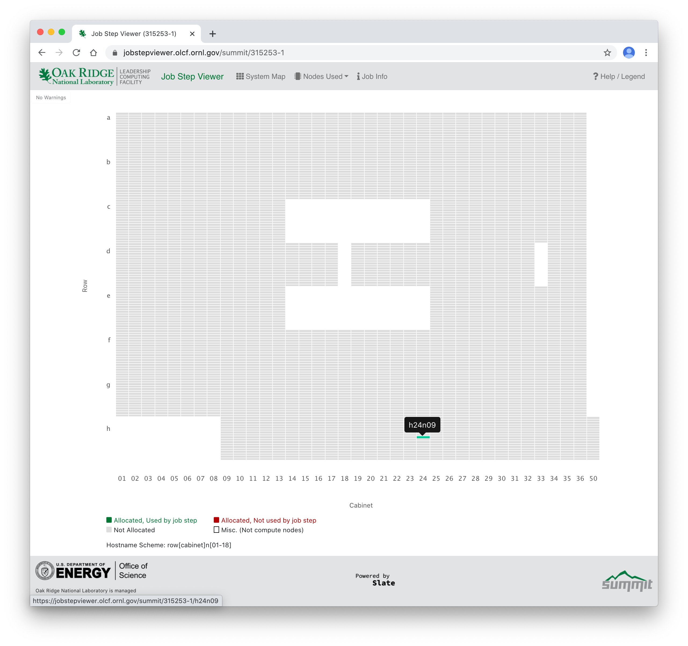

# Job Step Viewer and Machine Room Tour

When running programs on a workstation, most of the time you can simply execute `./a.out` and wait for the results. On most HPC clusters, you must use a "batch scheduler" to request one or more compute nodes to run on and a "job launcher" to execute your program on the compute node(s) you were allocated. You submit jobs on Summit with IBM's [`jsrun` job launcher](../jsrun_Job_Launcher).

The [Job Step Viewer](https://jobstepviewer.olcf.ornl.gov/) provides a graphical view of an application's runtime layout on Summit. It allows users to preview and quickly iterate with multiple jsrun options to understand and optimize job launch. It is a convenient tool that allows you to visualize and verify you are configuring your `jsrun` options in the way you expect.

We recommend attempting this Challenge in conjunction with the [`jsrun` Job Launcher](../jsrun_Job_Launcher) challenge. You should go through the first example or two to get an understanding of how the `jsrun` command works, then re-run the examples, integrating the Job Step Viewer into your submission script. Then you can continue to use the Viewer as you go through the remaining examples and visualize your submissions as you go.

## Job Step Viewer Usage

First, request an allocation of nodes on Summit:

```c
$ bsub -P GEN146 -W 10 -nnodes 1 -J testing_job_step_viewer -Is $SHELL
```

Once your node is allocated, load the `job-step-viewer` module:

```c
$ module load job-step-viewer
```

Run a `jsrun` command by itself, or with an executable, such as the `Hello_jsrun` from the [`jsrun` Challenge](../jsrun_Job_Launcher). A URL will be printed out after a few seconds:

```c
$ export OMP_NUM_THREADS=2
$ jsrun -n6 -c7 -g1 -a1


https://jobstepviewer.olcf.ornl.gov/ascent/315253-1

```

You will see a unique URL printed after `jsrun` executes (the above is an example only). Copy the URL from your terminal to your browser and load it.

<br>
<center>

</center>
<br>

Your allocated node(s) highlighted in green and/or red.

## Ascent & Summit Tour

Ascent is comprised of the same compute hardware as Summit, however, it is only a single cabinet with 18 nodes. It is physically co-located with Summit, but it has a separate network fabric and attached filesystem. Summit is comprised of many more cabinets laid out in a row/column fashion. This is output from a Job Step Viewer invocation on Summit showing the top-down overview of the machine room:

<br>
<center>

</center>
<br>

While the Ascent nodes do not appear on this diagram, the Ascent nodes are physically located in the lower right of this diagram.

Each cabinet of the machine of Summit is laid out and labeled on a Row [a-h], Cabinet [01-50] coordinate system. Each node has a hostname that contains this coordinate plus the node number (there are 18 nodes per cabinet). While Ascent is not a part of Summit, it is located in the same namespace. The hostname coordinate system is machine room-centric, rather than computer-centric, but it just so happens Summit occupies the vast majority of the room.

Rather than trying to imagine what this looks like in real life, OLCF has created a [3D virtual tour](https://my.matterport.com/show/?m=iBfbj7ET4LT) of the Summit machine room, for you to see for yourself.

For example, if you are allocated the node `h49n09`, the hostname indicates your node is in Row H, Cabinet 49 and is the 9th node from the bottom. This cabinet is physically 49 cabinets down from the ['left' side of Summit](https://my.matterport.com/show/?m=iBfbj7ET4LT&sr=-.4,-1.13&ss=110) (if we orientate ourselves according to the top-down view). Row H starts in column 9, and so `h49` is 41 cabinets down from the start of Row H (as you can see, the entryway physically precludes row H from starting all the way to the left). Navigate down the aisle between G and H and find [cabinet 49](https://my.matterport.com/show/?m=iBfbj7ET4LT). You can't see the nodes with the cabinet door closed here, but you can find a [representative cabinet](https://my.matterport.com/show/?m=iBfbj7ET4LT&sr=-.31,.18&ss=82) with the back door open and the [insides of a node](https://my.matterport.com/show/?m=iBfbj7ET4LT&sr=-2.53,.12&ss=11).

The sideways 'H' shaped gap in the middle of the layout are cabinets containing system infrastructure such as [interconnect gear](https://my.matterport.com/show/?m=iBfbj7ET4LT&sr=-.51,.9&ss=86), rather than compute nodes. Spend a few moments exploring the rest of the OLCF facility, finding and learning about other points of interest such as the File System, Operations Control Room, and Energy Plant.

### Node Layout

Nodes in your allocation will be highlighted in either green or red. Green nodes indicate the node is being used by the `jsrun` launch. Nodes highlighted in red are allocated to your job, but not being used by this invocation of `jsrun`. For example, if you _allocate_ two nodes with `bsub` but only _launch_ your job on one core or GPU with `jsrun`, one of the allocated nodes will be sitting idle and will show as red on the top-down view. This is a valuable tool to use while you are setting up jobs on Summit to verify you are launching them as you intend.

Clicking on one of the nodes in your allocation will bring up a diagram that should look familiar if you have gone through a couple of the [`jsrun` Challenge](../jsrun_Job_Launcher) examples. We recommend going through that Challenge to understand the layout of your launched job across the nodes and how to interpret this view, if you haven't already done so.

<br>
<center>

</center>
<br>

## Continuing the challenge

Using the Job Step Viewer is a great way to visualize the [`jsrun` Challenge](../jsrun_Job_Launcher) challenge examples. Given the example above, how can you integrate the viewer into these `jsrun` examples? The URL is printed to standard out, and if you provide an executable, it will then be ran as normal. The URL that is printed out will be available for a period of time after the job completes, so you do not necessarily need to view it in real time as the job is running.
